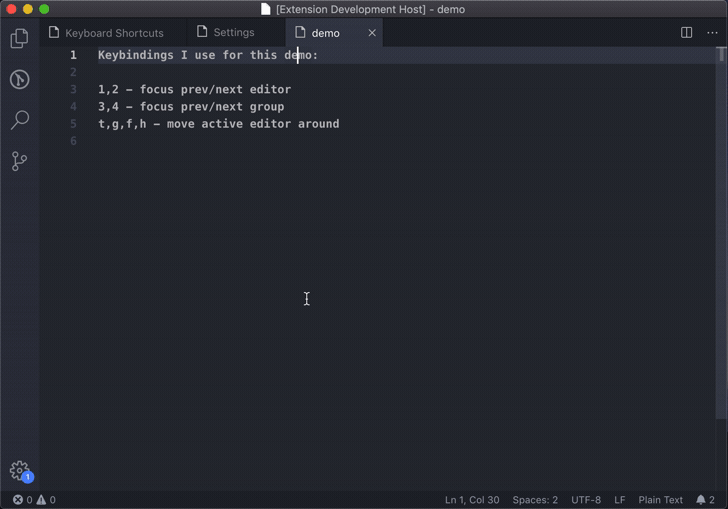

<p align="center">
  
</p>

<h1><p align="center">VS Code: Keybinding Mode</p></h1>

`Keybinding Mode` is a VS Code extension allowing you to bind commands to just a single letter on your keyboard. Gain 48 easy accessible keybinding slots as an alternative to complicated keybinding combos.

## Usage
By double pressing `` ` `` (you can configure your own shortcut) the editor will be switched to a special mode in which typing is disabled and keys act as command shortcuts. In the extension settings you can bind commands to letters. Double pressing `` ` `` again will disable special mode. The toast notification is shown every time the mode is switched.

## Configuration
To configure how to enter Keybinding Mode look for `Toggle Keybinding Mode` (`keybindingMode.toggle`) keyboard shortcut in VS Code keybindings settings. By default it is set to double `` ` ``.

To configure which command is assigned to which letter go to the extension settings, VS Code Settings -> Extensions -> KeybindingMode -> "Letter Command Mapping". Add mapping in a format of `<letter>,<command>`.

## Demo
In the demo below I bound sidebar toggling, git blame and git graph functionalities to `a`, `t` and `g` keys using following config:


```
Extension config:
a,workbench.action.toggleSidebarVisibility
t,gitlens.toggleFileBlame
g,git-graph.view
```

## Demo: Tabs
In the demo below I bound tabs related functionalities, like focusing editors and screen splitting, using following config:


```
Extension config:
1,workbench.action.previousEditorInGroup
2,workbench.action.nextEditorInGroup
3,workbench.action.focusPreviousGroup
4,workbench.action.focusNextGroup

t,workbench.action.moveEditorToAboveGroup
g,workbench.action.moveEditorToBelowGroup
h,workbench.action.moveEditorToRightGroup
f,workbench.action.moveEditorToLeftGroup
```

## Motivation
I extensively use tabs while I'm coding and so far I couldn't find easy (and not yet occupied) keybinding slots for all the shortcuts I want to use.
